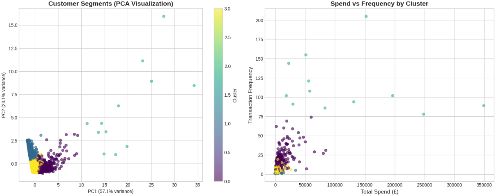
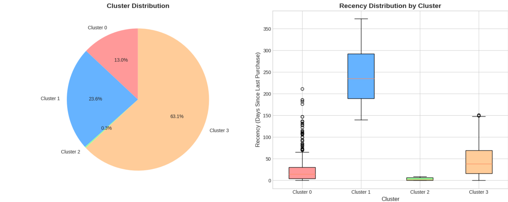
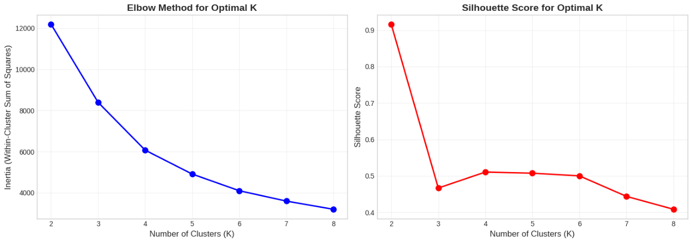
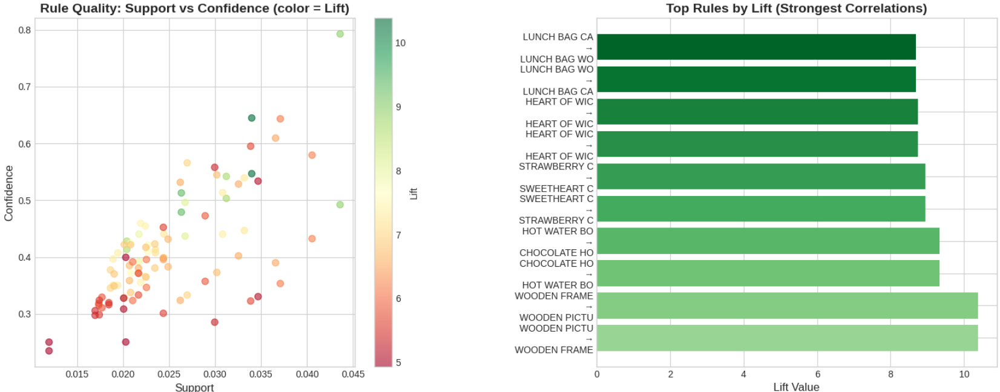
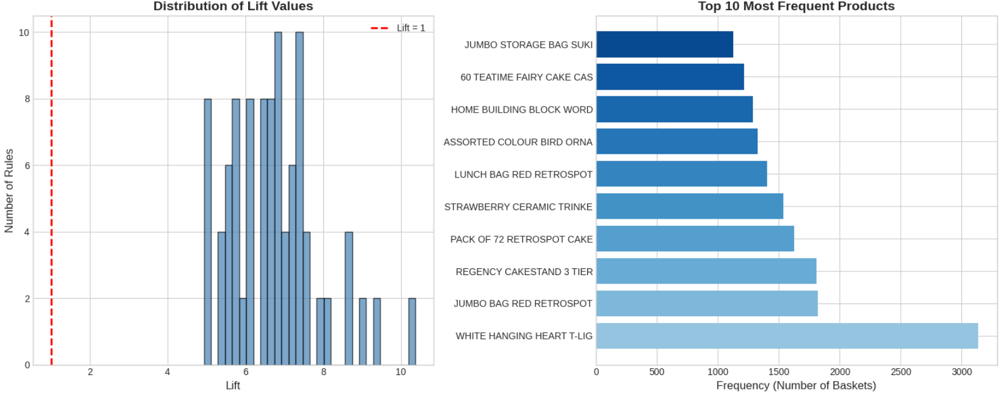

# CS4237: Data Mining & Warehousing - Final Project

## Customer Intelligence for Retail Chain: Segmentation & Market Basket Analysis


---

## 📋 Project Overview

This project was completed as the final examination for **CS4237: Data Mining & Warehousing** at Academic City University. The objective was to analyze retail transaction data to uncover customer segments and product associations that drive business value.

**Dataset:** UCI Online Retail II (525,461 transactions from a UK-based online retailer, Dec 2009 - Dec 2010)

### Two Business Questions

| Question | Approach |
|----------|----------|
| *"Which customer segments generate the highest value and what behaviors define them?"* | **K-Means Clustering** (RFM features) |
| *"What products are frequently purchased together?"* | **Association Rule Mining** (Support, Confidence, Lift) |

---

## 📊 Key Findings at a Glance

| Metric | Result |
|--------|--------|
| Customer Segments | **4 distinct segments** |
| VIP Segment | **0.3%** of customers, avg spend **£116,368** |
| Association Rules | **308 rules** discovered |
| Highest Lift | **10.38** (Wooden Picture Frames) |
| Data Preservation | **94.8%** of original data |
| Total Sales Value | **£22,084,220.58** |

---

## 👥 Customer Segments

After applying K-Means clustering with optimal K=4, here are the segments identified:

| | Segment | Size | Avg Spend | Strategy |
|--|---------|------|-----------|----------|
| 👑 | **VIP Elite** | 0.3% | £116,368 | Elite Concierge |
| 💎 | **High-Value Loyal** | 13.0% | £6,502 | VIP Retention |
| 🛍️ | **Occasional Buyers** | 63.1% | £1,166 | Growth Optimization |
| ⚠️ | **At-Risk** | 23.6% | £573 | Win-Back Campaign |

### Cluster Visualization


*Customer segments visualized using PCA (first two principal components)*


*Distribution of customers across the 4 segments*

### Elbow Method & Silhouette Score


*Determining optimal K=4 using elbow method and silhouette score*

---

## 🔗 Product Association Rules

Using Association Rule Mining, I discovered **308 product pairs** that are frequently purchased together.

### Top 5 Product Bundles

| Rank | Product A | Product B | Lift | Confidence |
|------|-----------|----------|------|-------------|
| 1 | Wooden Picture Frame White | Wooden Frame Antique White | **10.38** | 64.5% |
| 2 | Chocolate Hot Water Bottle | Hot Water Bottle Tea & Sympathy | **9.34** | 51.3% |
| 3 | Sweetheart Ceramic Trinket Box | Strawberry Ceramic Trinket Box | **8.95** | 79.3% |
| 4 | Heart of Wicker Small | Heart of Wicker Large | **8.74** | 54.2% |
| 5 | Lunch Bag Woodland | Lunch Bag Cars Blue | **8.68** | 42.8% |

### Rule Quality Visualization


*Top 10 association rules ranked by lift value*


*Distribution of lift values across all 308 rules (100 rules have Lift > 2)*

---

## 🏗️ ETL Pipeline Summary

### Extraction
- **Strategy:** Full Extraction (daily updates)
- **Volume:** 525,461 rows → ~5 minutes processing time
- **Rationale:** Manageable volume, captures all corrections and returns

### Transformation

| Step | Action | Result |
|------|--------|--------|
| Missing Values | CustomerID (20.54% missing) | Preserved with flagging, not deleted |
| Date Standardization | Converted to YYYY-MM-DD | Added Year, Month, Weekday columns |
| De-duplication | Removed 6,865 exact duplicates | Aggregated 12,688 logical duplicates |
| Data Quality | Removed invalid prices & cancelled invoices | 498,359 final rows (94.8% preserved) |

### Loading
- **Method:** UPSERT (UPDATE + INSERT)
- **Benefit:** Idempotent updates, preserves customer ID continuity

---

## 📈 Performance Optimization (Scaling to 500M Rows)

| Technique | How It Works | Improvement |
|-----------|--------------|-------------|
| **Indexing** | B-tree indexes on CustomerID, InvoiceDate | O(n) → O(log n) lookups |
| **Materialized Views** | Pre-computed daily/monthly aggregates | 500M rows → 500K rows |
| **Partitioning** | Monthly partitions by date | Queries scan only relevant partitions |

**Expected Result:** Query time from 20 minutes → 3-5 seconds

---

## ⚖️ Ethics & Bias Mitigation

### Identified Biases

| Bias | Issue | Mitigation |
|------|-------|------------|
| **Segmentation Bias** | Based only on spending/frequency | Add seasonal patterns, product categories |
| **Geographic Bias** | 92.4% UK data | Stratified analysis by region |
| **Data Collection** | 20.5% missing CustomerID | Flagged, not deleted; transparent documentation |

### Ethical AI Framework

- ✅ **Fairness** - Audit models for systematic exclusion
- ✅ **Transparency** - Document data limitations openly
- ✅ **Accountability** - Regular model audits (quarterly)
- ✅ **Privacy** - Anonymize customer data, comply with GDPR
- ✅ **Inclusivity** - Include international customer analysis

---

## 💻 Technologies Used

| Category | Technologies |
|----------|--------------|
| **Language** | Python 3.10+ |
| **Data Processing** | Pandas, NumPy |
| **Machine Learning** | Scikit-learn (KMeans, StandardScaler, PCA) |
| **Visualization** | Matplotlib, Seaborn |
| **Environment** | Google Colab / Jupyter Notebook |


---

## 🚀 How to Run

### Option 1: Google Colab (Recommended)

1. Open any notebook file in this repository
2. Click the "Open in Colab" button
3. Run cells sequentially
4. Dataset loads automatically from UCI

### Option 2: Local Environment

```bash
# Clone the repository
git clone https://github.com/YOUR_USERNAME/CS4237-DataMining-Project.git
cd CS4237-DataMining-Project

# Install dependencies
pip install pandas numpy matplotlib seaborn scikit-learn

# Run notebooks
jupyter notebook notebooks/
```
## 📝 Report & Presentation

| File | Description |
|------|-------------|
| `report.pdf` | Full documentation including Star Schema, ETL details, cluster profiles, and business recommendations |
| `presentation.pptx` | 11 slides for a 5-minute overview |

---

## 👩‍💻 Author

**Ama Baduwa Baidoo**  
Student ID: 10012200033  
Course: CS4237 - Data Mining & Warehousing  
Academic City University  
Faculty of Computational Sciences and Informatics  

**Lecturer:** Dr. Peter Tettey Yamak

---

## 📚 References

1. UCI Machine Learning Repository. (2019). *Online Retail II Dataset*.  
   https://archive.ics.uci.edu/ml/datasets/Online+Retail+II

2. Agrawal, R., & Srikant, R. (1994). *Fast Algorithms for Mining Association Rules*.  
   Proceedings of the 20th International Conference on Very Large Data Bases, 487-499.

3. MacQueen, J. (1967). *Some Methods for Classification and Analysis of Multivariate Observations*.  
   Proceedings of the 5th Berkeley Symposium on Mathematical Statistics and Probability, 1, 281-297.

4. Kimball, R., & Ross, M. (2013). *The Data Warehouse Toolkit: The Definitive Guide to Dimensional Modeling* (3rd ed.). Wiley.

---

## 📄 License

This project was created for academic purposes as part of CS4237 coursework.

